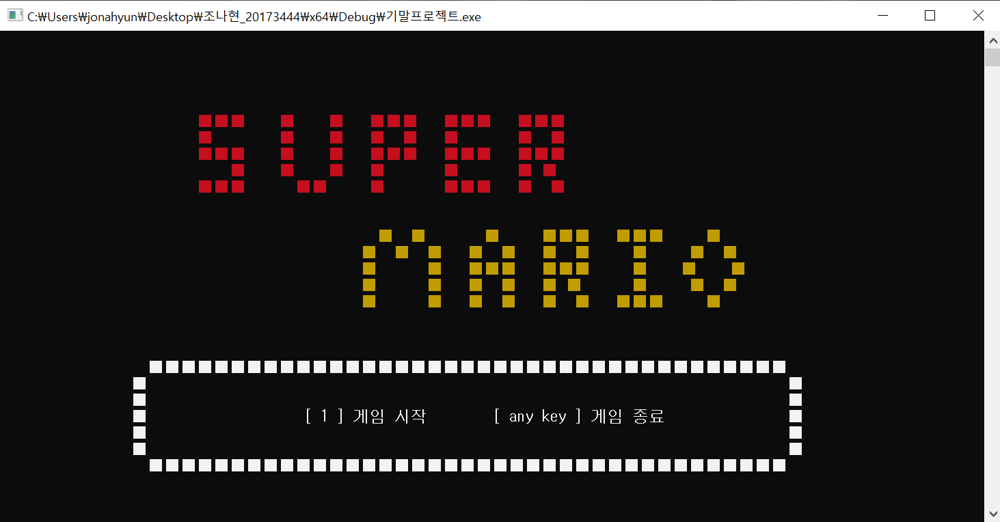
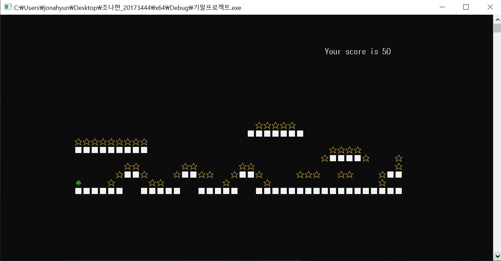
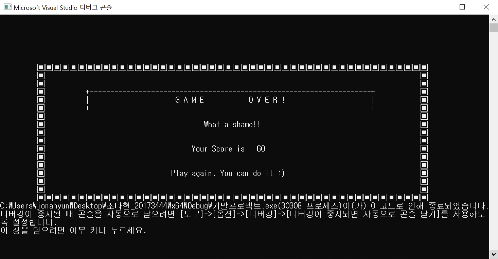
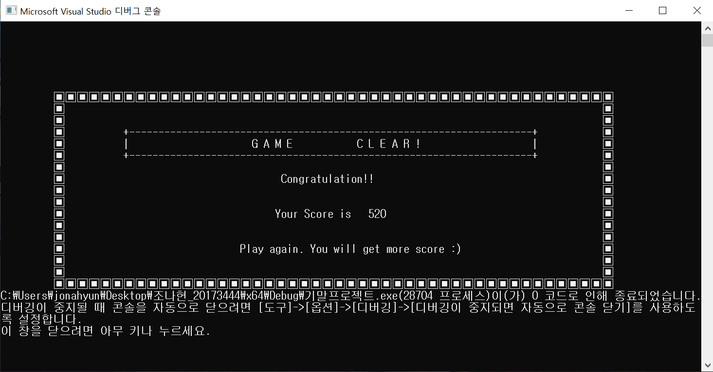

# MarioGame
2학년 C응용 수업 기말 프로젝트로 만든 파일  
'C 콘솔로도 게임을 만들수 있을까' 라는 생각으로 도전  
->결론적으로 만들 수는 있지만 퀄리티가 아쉽다  
콘솔만으로 음악재생, 색깔 변환, xy축 이동을 구현할 수 있음을 배움

  
  
## 기능
1. 시작 시 슈퍼마리오 인트로 음악 재생
2. 방향키를 이용해(<- ->) 마리오 이동 가능  
2-1. 점프는 스페이스바(소리 난다 와-악)
3. 별 먹으면 우측 상단 score 10점 증가(소리 난다 띠-링)
4. 최하단의 빈블록 이동시 게임 종료
